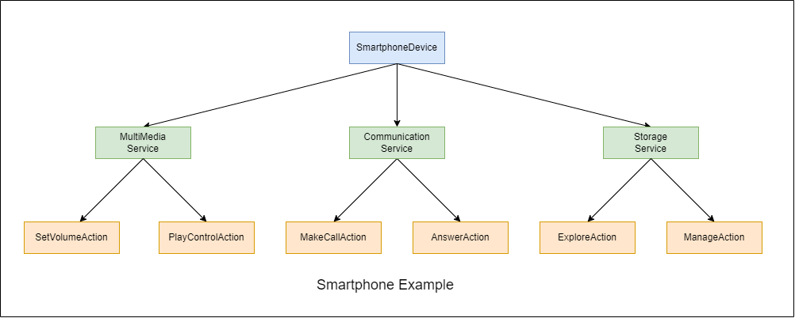
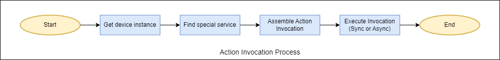

# Cling in java

## Three important concepts in cling
Before you start using the Cling framework, you must understand three concepts
in Cling. One is `Device`, and the other is `Service`, the last is `Action`


Take our smartphone device as an example. It has multimedia, communication, and storage services.
Under the multimedia service, you can execute actions such as play, pause, and set volume.




## Implement smartphone example
Through the above image, we can hava a preliminary image of the `Device-Service-Action`
three-layer architecture. Next, we will implement **Smartphone Example** by java code.

1. Step one, create a maven project and import related dependencies (Note: Please use `apache-maven-3.6.3`,
the higher versions don't allow use HTTP repository url directly)
```xml
<project xmlns="http://maven.apache.org/POM/4.0.0" xmlns:xsi="http://www.w3.org/2001/XMLSchema-instance"
         xsi:schemaLocation="http://maven.apache.org/POM/4.0.0 http://maven.apache.org/xsd/maven-4.0.0.xsd">
  <modelVersion>4.0.0</modelVersion>

  <groupId>org.example</groupId>
  <artifactId>cling-in-java</artifactId>
  <version>1.0-SNAPSHOT</version>
  <packaging>jar</packaging>

  <name>cling-in-java</name>
  <url>http://maven.apache.org</url>

  <properties>
    <project.build.sourceEncoding>UTF-8</project.build.sourceEncoding>
    <jetty.version>8.1.14.v20131031</jetty.version>
    <slf4j.version>6.1.26</slf4j.version>
  </properties>

  <dependencies>
    <dependency>
      <groupId>commons-io</groupId>
      <artifactId>commons-io</artifactId>
      <version>2.11.0</version>
    </dependency>

    <dependency>
      <groupId>org.eclipse.jetty</groupId>
      <artifactId>jetty-server</artifactId>
      <version>${jetty.version}</version>
    </dependency>

    <dependency>
      <groupId>org.eclipse.jetty</groupId>
      <artifactId>jetty-servlet</artifactId>
      <version>${jetty.version}</version>
    </dependency>

    <dependency>
      <groupId>org.eclipse.jetty</groupId>
      <artifactId>jetty-client</artifactId>
      <version>${jetty.version}</version>
    </dependency>

    <dependency>
      <groupId>org.slf4j</groupId>
      <artifactId>slf4j-jdk14</artifactId>
      <version>1.7.25</version>
    </dependency>

    <dependency>
      <groupId>org.fourthline.cling</groupId>
      <artifactId>cling-support</artifactId>
      <version>2.1.1</version>
    </dependency>

    <dependency>
      <groupId>junit</groupId>
      <artifactId>junit</artifactId>
      <version>3.8.1</version>
      <scope>test</scope>
    </dependency>

    <dependency>
      <groupId>org.fourthline.cling</groupId>
      <artifactId>cling-core</artifactId>
      <version>2.1.1</version>
    </dependency>
  </dependencies>

  <repositories>
    <repository>
      <id>nexus-4thline</id>
      <!--Note: Please use `apache-maven-3.6.3`, the higher versions don't allow use HTTP repository url-->
      <url>http://4thline.org/m2/</url>
    </repository>
  </repositories>
</project>

```
2. Step two, creating service and device (For simplicity, we only implement the multimedia service)

```java
package org.example;

import org.fourthline.cling.binding.annotations.*;

@UpnpService(
        serviceId = @UpnpServiceId(MultiMediaService.SERVICE_ID),
        serviceType = @UpnpServiceType(MultiMediaService.SERVICE_ID)
)
public class MultiMediaService {
    public static final String SERVICE_ID = "MultiMediaService";
    public static final String ACTION_SET_VOLUME = "SetVolume";
    
    @UpnpStateVariable(defaultValue = "50")
    private String volume = "50"; // the UpnpStateVariable only support java.lang.String type

    @UpnpAction
    public void setVolume(@UpnpInputArgument(name = "ExpiredVolumeValue") String expiredVolumeValue) {
        int volumeValue = Integer.parseInt(expiredVolumeValue);
        if (volumeValue < 0 || volumeValue > 100) {
            throw new IllegalArgumentException(String.format("VolumeValue range between [0, 100], you input value is %s", volumeValue));
        }
        volume = expiredVolumeValue;
    }

    @UpnpAction(out = @UpnpOutputArgument(name = "RealVolumeValue"))
    public String getVolume() {
        return volume;
    }
}


```

```java
package org.example;

import org.fourthline.cling.binding.annotations.AnnotationLocalServiceBinder;
import org.fourthline.cling.model.DefaultServiceManager;
import org.fourthline.cling.model.ValidationException;
import org.fourthline.cling.model.meta.DeviceDetails;
import org.fourthline.cling.model.meta.DeviceIdentity;
import org.fourthline.cling.model.meta.LocalDevice;
import org.fourthline.cling.model.meta.LocalService;
import org.fourthline.cling.model.types.DeviceType;
import org.fourthline.cling.model.types.UDN;

public class SmartphoneDevice {
    public static LocalDevice getInstance() {
        DeviceIdentity deviceIdentity = new DeviceIdentity(UDN.uniqueSystemIdentifier("SmartphoneDevice"));
        DeviceType deviceType = new DeviceType("org.example", "SmartphoneDevice");
        DeviceDetails deviceDetails = new DeviceDetails("SmartphoneDevice");
        LocalService volumeControlService = new AnnotationLocalServiceBinder().read(MultiMediaService.class);
        volumeControlService.setManager(new DefaultServiceManager(volumeControlService, MultiMediaService.class));
        LocalDevice localDevice = null;
        try {
            localDevice = new LocalDevice(deviceIdentity, deviceType, deviceDetails, volumeControlService);
            return localDevice;
        } catch (ValidationException e) {
            throw new RuntimeException(e);
        }
    }
}

```

## Executing action in custom device
We have now created a **smartphone device** with **multimedia service**. Next, we
will demonstrate how to execute the **SetVolume** action in this service.




```java
package org.example;

import org.fourthline.cling.UpnpServiceImpl;
import org.fourthline.cling.controlpoint.ActionCallback;
import org.fourthline.cling.model.action.ActionInvocation;
import org.fourthline.cling.model.message.UpnpResponse;
import org.fourthline.cling.model.meta.Action;
import org.fourthline.cling.model.meta.LocalDevice;
import org.fourthline.cling.model.meta.LocalService;
import org.fourthline.cling.model.types.UDAServiceId;
import org.junit.Test;

public class AppTest
{
    @Test
    public void testActionInvocation() {
        // get smartphone device instance
        LocalDevice localDevice = SmartphoneDevice.getInstance();
        // find multiMediaService in device
        LocalService service = localDevice.findService(new UDAServiceId(MultiMediaService.SERVICE_ID));
        invocationActionSync(service);
        invocationActionAsync(service);
    }


    public void invocationActionSync(LocalService service) {
        UpnpServiceImpl upnpService = new UpnpServiceImpl();
        Action action = service.getAction(MultiMediaService.ACTION_SET_VOLUME);
        ActionInvocation actionInvocation = new ActionInvocation<>(action);
        actionInvocation.setInput("ExpiredVolumeValue", "88");
        new ActionCallback.Default(actionInvocation, upnpService.getControlPoint()).run();
    }
    public void invocationActionAsync(LocalService service) {
        UpnpServiceImpl upnpService = new UpnpServiceImpl();
        Action action = service.getAction(MultiMediaService.ACTION_SET_VOLUME);
        ActionInvocation actionInvocation = new ActionInvocation<>(action);
        actionInvocation.setInput("ExpiredVolumeValue", "99");
        upnpService.getControlPoint().execute(new ActionCallback(actionInvocation) {
            @Override
            public void success(ActionInvocation invocation) {
                System.out.println(invocation);
            }

            @Override
            public void failure(ActionInvocation invocation, UpnpResponse operation, String defaultMsg) {
                System.out.println(defaultMsg);
            }
        });
        // Avoiding function complete immediately
        try {
            Thread.sleep(1000 * 60);
        } catch (InterruptedException e) {
            throw new RuntimeException(e);
        }
    }
}

```

## Executing action in network device
In the above example, we directly obtained the smartphone device instance through
the `SmartphoneDevice.getInstance`. However, in the actual development process.
we rarely customize devices, we only need to find special device in LAN (Local area network)
,then invocation action in this device.


In the next, we will create two thread to simulate search device in LAN.
1. The `ServeThread` provide smartphone device.
2. The `ClientThread` find the device by network, then invocation action in this device.

```java
package org.example;

import org.fourthline.cling.UpnpServiceImpl;
import org.fourthline.cling.binding.annotations.*;
import org.fourthline.cling.registry.Registry;

public class ServeThread implements Runnable {
    public static void main(String[] args) {
        Thread thread = new Thread(new ServeThread());
        thread.setDaemon(false);
        thread.start();
    }

    @Override
    public void run() {
        UpnpServiceImpl upnpService = new UpnpServiceImpl();
        Registry registry = upnpService.getRegistry();
        registry.addDevice(SmartphoneDevice.getInstance());
    }
}

```

```java
package org.example;

import org.fourthline.cling.UpnpServiceImpl;
import org.fourthline.cling.controlpoint.ActionCallback;
import org.fourthline.cling.model.action.ActionInvocation;
import org.fourthline.cling.model.message.UpnpResponse;
import org.fourthline.cling.model.meta.*;
import org.fourthline.cling.model.types.UDAServiceId;
import org.fourthline.cling.registry.Registry;
import org.fourthline.cling.registry.RegistryListener;

public class ClientThread implements Runnable, RegistryListener {
    public static void main(String[] args) {
        Thread thread = new Thread(new ClientThread());
        thread.setDaemon(false);
        thread.start();
    }

    @Override
    public void run() {
        UpnpServiceImpl upnpService = new UpnpServiceImpl();
        Registry registry = upnpService.getRegistry();
        registry.addListener(this);
        upnpService.getControlPoint().search();
    }

    @Override
    public void remoteDeviceDiscoveryStarted(Registry registry, RemoteDevice device) {

    }

    @Override
    public void remoteDeviceDiscoveryFailed(Registry registry, RemoteDevice device, Exception ex) {

    }

    @Override
    public void remoteDeviceAdded(Registry registry, RemoteDevice device) {
        UDAServiceId udaServiceId = new UDAServiceId(MultiMediaService.SERVICE_ID);
        RemoteService service = device.findService(udaServiceId);
        if (service != null) {
            // find the smartphone device
            invocationActionSync(service);
            invocationActionAsync(service);
        }
    }

    @Override
    public void remoteDeviceUpdated(Registry registry, RemoteDevice device) {

    }

    @Override
    public void remoteDeviceRemoved(Registry registry, RemoteDevice device) {

    }

    @Override
    public void localDeviceAdded(Registry registry, LocalDevice device) {

    }

    @Override
    public void localDeviceRemoved(Registry registry, LocalDevice device) {

    }

    @Override
    public void beforeShutdown(Registry registry) {

    }

    @Override
    public void afterShutdown() {

    }
    public void invocationActionSync(Service service) {
        UpnpServiceImpl upnpService = new UpnpServiceImpl();
        Action action = service.getAction(MultiMediaService.ACTION_SET_VOLUME);
        ActionInvocation actionInvocation = new ActionInvocation<>(action);
        actionInvocation.setInput("ExpiredVolumeValue", "88");
        new ActionCallback.Default(actionInvocation, upnpService.getControlPoint()).run();
    }
    public void invocationActionAsync(Service service) {
        UpnpServiceImpl upnpService = new UpnpServiceImpl();
        Action action = service.getAction(MultiMediaService.ACTION_SET_VOLUME);
        ActionInvocation actionInvocation = new ActionInvocation<>(action);
        actionInvocation.setInput("ExpiredVolumeValue", "99");
        upnpService.getControlPoint().execute(new ActionCallback(actionInvocation) {
            @Override
            public void success(ActionInvocation invocation) {
                System.out.println(invocation);
            }

            @Override
            public void failure(ActionInvocation invocation, UpnpResponse operation, String defaultMsg) {
                System.out.println(defaultMsg);
            }
        });
        // Avoiding function complete immediately
        try {
            Thread.sleep(1000 * 60);
        } catch (InterruptedException e) {
            throw new RuntimeException(e);
        }
    }
}

```

Because we have created two long-time keep alive thread, it is difficult to 
verify action invocation by debugger. The best way is to print volume value
in console after `setVolume` function end.


When you print volume value, you will see twice output in console, one is sync
, the other is async.

## Reference
1. [Official document of Cling core](http://4thline.org/projects/cling/core/manual/cling-core-manual.xhtml)


